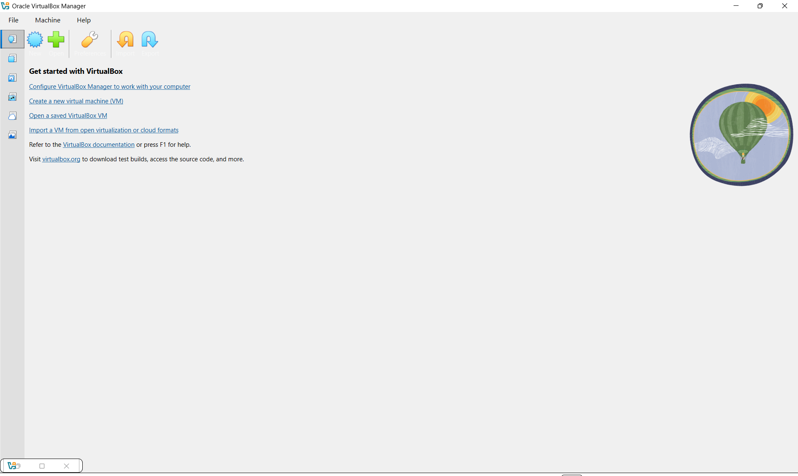
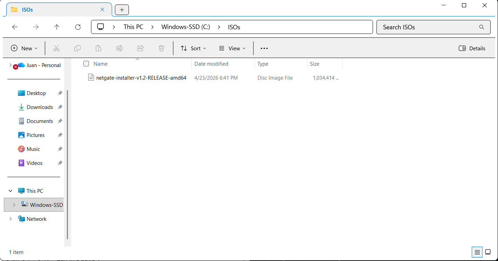
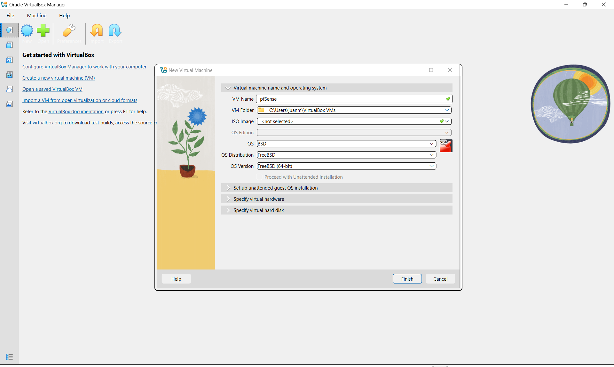

# Architecture Notes

This directory contains diagrams and documentation describing the IT Solutions enterprise environment.

## Included Diagrams

- Network topology  
- VM layout  
- Hybrid identity flow  
- Firewall/VLAN segmentation  

## Purpose

These diagrams provide visual context for how identity, networking, cloud, and security components interact across the environment.

---

## Virtualization Platform Setup

This section documents the installation and configuration of the virtualization layer used to host all servers, clients, and network appliances in the IT Solutions enterprise environment.

### VirtualBox Installation

VirtualBox was installed as the primary hypervisor for the homelab.  
This provides the compute, storage, and networking foundation for the entire environment.

#### Screenshot: VirtualBox Installed

---

### ISO Storage Directory

All operating system installation media (ISOs) are stored in a dedicated folder for consistency and organization.

#### Screenshot: ISO Folder

---

### pfSense VM Configuration

The pfSense firewall VM was created using the BSD → FreeBSD (64-bit) template.  
This VM will serve as the core network security and routing appliance for the environment.

#### Screenshot: pfSense VM Settings

